# 🚀 Rentechify | Smart Tech Rentals

<div align="center">

[](https://rentechify.web.app)
[](https://rentechify.web.app)
[](LICENSE)

</div>

<p align="center">
  
</p>

## 💡 About Rentechify

Rentechify revolutionizes tech rentals with a seamless platform for on-demand access to premium gadgets and electronics. Our intelligent booking system with AI-powered support ensures a frictionless rental experience from selection to return.

**[Experience Rentechify →](https://rentechify.web.app)**

## ⚙️ Core Capabilities

<table>
  <tr>
    <td width="33%">
      <h3>🎯 Smart Booking</h3>
      <ul>
        <li>Precision 15-minute booking increments</li>
        <li>Intelligent inventory management</li>
        <li>Automated availability updates</li>
      </ul>
    </td>
    <td width="33%">
      <h3>🔍 AI Verification</h3>
      <ul>
        <li>Real-time damage assessment</li>
        <li>Automated condition reporting</li>
        <li>Before/after comparison analysis</li>
      </ul>
    </td>
    <td width="33%">
      <h3>👥 Multi-User Platform</h3>
      <ul>
        <li>Admin dashboard analytics</li>
        <li>Agent fulfillment interface</li>
        <li>Customer rental portal</li>
      </ul>
    </td>
  </tr>
</table>

## 🛠️ Technology Architecture


## 🧠 AI-Powered Features

<div align="center">
  <table>
    <tr>
      <th>Feature</th>
      <th>Description</th>
      <th>Benefit</th>
    </tr>
    <tr>
      <td>📊 Dynamic Pricing</td>
      <td>AI-driven price optimization based on demand, time, and location</td>
      <td>Maximizes revenue while offering competitive rates</td>
    </tr>
    <tr>
      <td>🔍 Damage Detection</td>
      <td>Computer vision algorithms to assess equipment condition</td>
      <td>Reduces disputes and ensures fair billing</td>
    </tr>
    <tr>
      <td>🗣️ Multilingual Support</td>
      <td>Real-time translation across 8 languages</td>
      <td>Provides global accessibility</td>
    </tr>
    <tr>
      <td>🔮 Predictive Maintenance</td>
      <td>Analytics-based maintenance scheduling</td>
      <td>Minimizes downtime and extends device lifespan</td>
    </tr>
  </table>
</div>

## 🔄 Rental Workflow

```mermaid
sequenceDiagram
    participant User
    participant App as Rentechify App
    participant AI as AI System
    participant Agent
    
    User->>App: Browse available gadgets
    App->>User: Display options & pricing
    User->>App: Select gadget & timeframe
    App->>AI: Verify availability & eligibility
    AI->>App: Confirmation & payment request
    User->>App: Complete payment
    App->>Agent: Dispatch rental request
    Agent->>User: Deliver equipment
    Note over User,Agent: Rental Period
    User->>App: Initiate return process
    App->>AI: Run condition assessment
    AI->>App: Generate return report
    App->>User: Process deposit refund
```



## 📱 Available Devices

<div align="center">
  <table>
    <tr>
      <td align="center"><b>📷 Cameras</b><br>Sony, Canon, DJI</td>
      <td align="center"><b>💻 Laptops</b><br>MacBook Pro, Surface</td>
      <td align="center"><b>🎮 Gaming</b><br>PS5, Xbox, VR</td>
      <td align="center"><b>📱 Mobile</b><br>Latest iPhones, Galaxy</td>
    </tr>
    <tr>
      <td align="center"><b>🎧 Audio</b><br>Pro Headphones, Mics</td>
      <td align="center"><b>🖥️ Displays</b><br>4K, 8K, Projectors</td>
      <td align="center"><b>🤖 Drones</b><br>DJI, Skydio</td>
      <td align="center"><b>⌚ Wearables</b><br>Apple Watch, Fitbit</td>
    </tr>
  </table>
</div>

## 🚀 Getting Started

```bash
# Clone repository
git clone https://github.com/codegeeksteam/RentifyTech

# Install dependencies
cd rentechify
npm install

# Start development server
npm run dev

# Build for production
npm run build
```

## 🔐 Security Features

- End-to-end encryption for payments
- Two-factor authentication 

## 📞 Support

Need assistance? Our AI support team is available 24/7:

- 💬 [Live Chat](https://rentechify.web.app)
- 📧 codegeeksteam@gmail.com
- 📱 +1 (800) RENT-TECH

## 📄 License

Rentechify is available under the MIT License. See the [LICENSE](LICENSE) file for more info.

---

<p align="center">
  <a href="https://rentechify.web.app">Website</a> •
  <a href="https://rentechify.web.app/docs">Documentation</a> •
  <a href="https://rentechify.web.app/blogs">Blog</a> •
  <a href="https://rentechify.web.app/contact-us">Support</a>
</p>